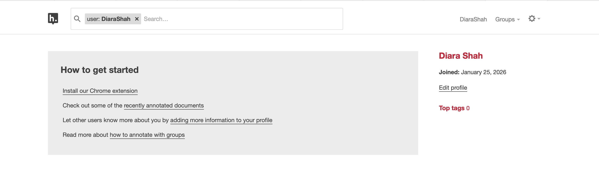

# Init IS310 Homework

## Proof of Installation

### 1. Python

### 2. Git

### 3. VS Code

### 4. Hypothesis
username - Diara Shah

Use of github COPilot in future work but no use of AI in this weeks homework